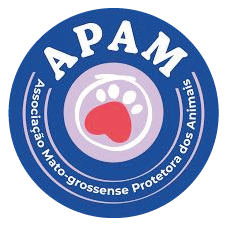

<p align="center">
  
</p>

# APAM
A APAM é uma associação cujo objetivo é proteger os animais contra o abandono e os maus-tratos. Com sede em Cuiabá, a ONG abriga cerca de 60 animais que são tratados e encaminhados para adoção responsável.

# Índice
- [Funcionalidades](#funcionalidades)
- [Requisitos e Tecnologias Usadas](#requisitos-e-tecnologias-usadas)
- [Licença](#licença)
- [Contribuições](#contribuições)
- [Time de Desenvolvedores](#time-de-desenvolvedores)

<div id='funcionalidades'/> 

# Funcionaluidades

## Banco de Dados
| Modelo Conceitual | Modelo Lógico |
|-------------------|---------------|
|  |  |

## Diagrama de Fluxo de Dados
<p align="center">
  
</p>

## Acessando o Sistema
### Login
| Normal Mode | Error Mode |
|-------------|------------|
|  |  |

### Tela de Seleção
| Normal Mode | Menu Mode |
|-------------|------------|
|  |  |

## Informações do Animal
### Cadastrando um Animal

### Consultando um Animal

## Informações do Adotante
### Cadastrando um Adotante

### Consultando um Adotante

## Tela Sobre 

## Sistema de Notificações

## Sistema de Logs

## Sistema de BackUps

<div id='requisitos-e-tecnologias-usadas'/> 

# Requisitos e Tecnologias Usadas
> Versão do Python: 3.10.12

## Tecnologias
- [Flet](https://flet.dev/)
- [Pandas](https://pandas.pydata.org/)
- [SQLite](https://www.sqlite.org/)
- [DOTENV](https://pypi.org/project/python-dotenv/)
- [PyTest](https://docs.pytest.org/en/8.2.x/)

<div id='licença'/> 

# Licença
```
  MIT License

  Copyright (c) 2024 APAM

  Permission is hereby granted, free of charge, to any person obtaining a copy of this
  software and associated documentation files (the "Gerenciador de Animais da APAM"),
  to deal in the Software without restriction, including without limitation the rights
  to use, copy, modify, merge, publish, distribute, sublicense, and/or sell
  copies of the Software, and to permit persons to whom the Software is
  furnished to do so, subject to the following conditions:

  The above copyright notice and this permission notice shall be included in all
  copies or substantial portions of the Software.

  THE SOFTWARE IS PROVIDED "AS IS", WITHOUT WARRANTY OF ANY KIND, EXPRESS OR
  IMPLIED, INCLUDING BUT NOT LIMITED TO THE WARRANTIES OF MERCHANTABILITY,
  FITNESS FOR A PARTICULAR PURPOSE AND NONINFRINGEMENT. IN NO EVENT SHALL THE
  AUTHORS OR COPYRIGHT HOLDERS BE LIABLE FOR ANY CLAIM, DAMAGES OR OTHER
  LIABILITY, WHETHER IN AN ACTION OF CONTRACT, TORT OR OTHERWISE, ARISING FROM,
  OUT OF OR IN CONNECTION WITH THE SOFTWARE OR THE USE OR OTHER DEALINGS IN THE
  SOFTWARE.
```

<div id='contribuições'/> 

# Contribuições

Contribuições são sempre bem-vindas! Para contribuir com o projeto, siga os passos abaixo:

1. **Crie uma Issue**: Descreva a funcionalidade a ser implementada ou o bug a ser corrigido.
2. **Aguarde uma Resposta**: Verifique se já não há outro desenvolvedor trabalhando na mesma tarefa.
3. **Mãos à Obra**: Caso a etapa 2 seja verdadeira e não haja ninguém encarregado do bug ou feature que você reportou, você mesmo pode desenvolvê-lo/corrigi-lo.

## Etapas para Contribuir

### 1. Fork o Repositório
Faça um fork do repositório clicando no botão "Fork" no GitHub. 

### 2. Clone o Projeto
Clone o seu fork do repositório com o comando:

```bash
git clone https://github.com/SEU_NOME_DE_USUARIO_GITHUB/Gerenciador_Animais_APAM.git
```

### 3. Crie um Ambiente Virtual
Navegue até a pasta do projeto e crie um ambiente virtual para instalar as dependências isoladamente:

```bash
cd Gerenciador_Animais_APAM
python3 -m venv venv
source venv/bin/activate  # No Windows use `venv\Scripts\activate`
```

### 4. Instale os Requisitos
Com o ambiente virtual ativado, instale as dependências necessárias:

```bash
pip install -r requirements.txt
```

### 5. Execute o Projeto
Com as dependências instaladas, você pode executar o projeto usando o comando:

```bash
python3 src/app.py
```

### 6. Crie Sua Branch
Por boas práticas, crie uma nova branch para a funcionalidade ou correção que você vai trabalhar. Use o comando:

```bash
git checkout -b NOME_DA_FUNCIONALIDADE
```

### 7. Faça Commits das Suas Mudanças
Faça commits das suas mudanças com mensagens claras e descritivas. Por exemplo:

```bash
git add .
git commit -m "Adiciona funcionalidade X"
```

### 8. Atualize Seu Fork
Antes de enviar o pull request, certifique-se de que seu fork está atualizado com o repositório original:

```bash
git checkout main
git pull origin main
git checkout NOME_DA_FUNCIONALIDADE
git rebase main
```

### 9. Envie Seu Pull Request
Depois de fazer suas alterações e garantir que seu fork está atualizado, envie seu pull request:

```bash
git push origin NOME_DA_FUNCIONALIDADE
```

No GitHub, vá para o seu repositório fork, encontre a sua branch e clique em "New Pull Request".

---

Ficaremos felizes em receber suas contribuições! Lembre-se de seguir os padrões do projeto ao enviar um pull request e de revisar o código antes de submetê-lo. Caso queira que seu nome seja inserido em `Time de Desenvolvedores` basta enviar seu linkedin junto ao PR. Obrigado por colaborar!

---

<div id='time-de-desenvolvedores'/> 

# Time de  Desenvolvedores

<div align="center">
  <table style="margin-left: auto; margin-right: auto;">
    <tr>
      <th style="text-align: center;">Cargo</th>
      <th style="text-align: center;">Nome</th>
    </tr>
    <tr>
      <td>ADS, Designer e Developer</td>
      <td><a href="https://www.linkedin.com/in/veras-d/">Veras</a></td>
    </tr>
    <tr>
      <td>DBA e Developer</td>
      <td><a href="https://www.linkedin.com/in/willianrsantos/">Willian Ribeiro</a></td>
    </tr>
    <tr>
      <td>UI Developer</td>
      <td><a href="https://www.linkedin.com/in/allan-andrade-0a3361229/">Allan Andrade</a></td>
    </tr>
    <tr>
      <td>Developer</td>
      <td><a href="https://www.linkedin.com/in/dayvisson-tenorio/">Dayvisson Tenório</a></td>
    </tr>
    <tr>
      <td>Developer</td>
      <td><a href="https://www.linkedin.com/in/arantesgustavoo/">Gustavo Oliveira</a></td>
    </tr>
    <tr>
      <td>Developer</td>
      <td><a href="https://www.linkedin.com/in/luan-alencar/">Luan Carlos</a></td>
    </tr>
    <tr>
      <td>Tester Developer</td>
      <td><a href="https://www.linkedin.com/in/lucas-alexandre-47a6672a0/">Lucas Alexandre</a></td>
    </tr>
    <tr>
      <td>Technical Recruiter</td>
      <td><a href="https://www.linkedin.com/in/gabriel-bandeira-macedo-a2107a139/">Gabriel Bandeira</a></td>
    </tr>
  </table>
</div> 
